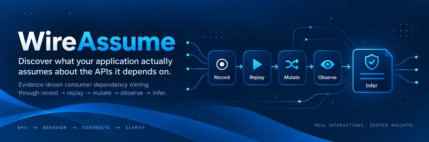
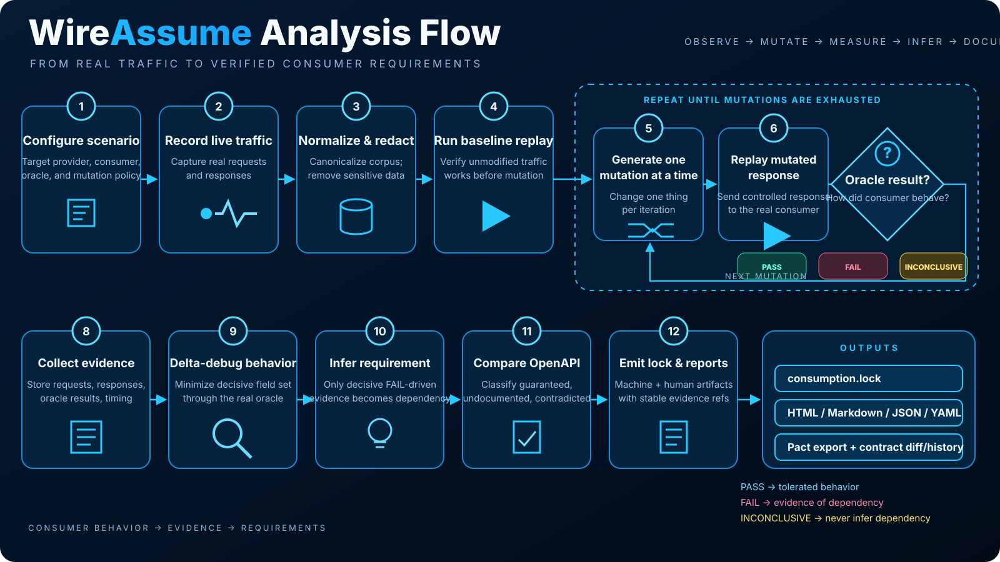
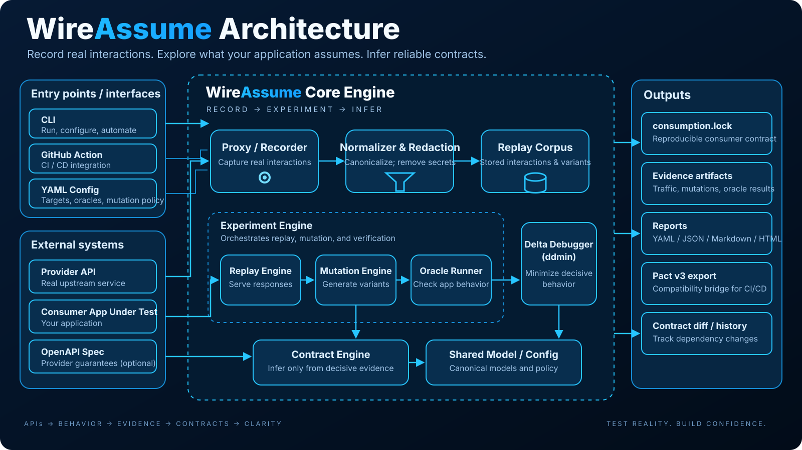

<p align="center">
  
</p>

<div align="center">

[](https://github.com/PSR94/WireAssume/actions/workflows/rust.yml)
[](https://github.com/PSR94/WireAssume/actions/workflows/demo.yml)
[](LICENSE)

</div>

WireAssume is an evidence-driven consumer-dependency mining tool. It records provider traffic, replays it deterministically, mutates one provider behavior at a time, runs a real consumer workflow through an oracle, observes `PASS` / `FAIL` / `INCONCLUSIVE`, minimizes surviving behavior, infers only evidence-supported consumer requirements, compares those requirements with provider OpenAPI guarantees, and emits an evidence-backed `consumption.lock` plus reports.

> **Ground-truth rule:** a field, header, status, ordering rule, or other behavior is **not** a consumer assumption merely because it appears in recorded traffic or in OpenAPI. WireAssume may call it a dependency only when changing that provider behavior changes the outcome of the real consumer workflow.

---

# Project checkpoint — start here next time

**Checkpoint date:** September 9, 2026 (America/New_York)  
**Project version:** `0.1.0` pre-release; no stable release/tag is claimed yet.  
**Repository:** `PSR94/WireAssume`  
**Primary branch:** `main`  
**Validated code baseline immediately before this README checkpoint:** `c1b8dee32d3b2e1b4205d1b55233ac70d8f43d60`  
**Latest major feature checkpoint before the cleanup commits:** `62c50cb` — deterministic contract regression checks and Pact export.  
**Rust toolchain:** `1.98`  
**License:** Apache-2.0.

This README is intentionally the **project handoff document as well as the public product README**. A future work session should be able to start here without rereading the entire repository history.

## Rules for the next work session

1. Start from the current `main`; do **not** rebuild or restart the repository from scratch.
2. Preserve the deterministic Rust core and the evidence-before-inference rule.
3. Do not claim a feature complete until it is exercised by tests or a real end-to-end workflow.
4. Do not infer consumer requirements from OpenAPI, recorded presence, heuristics, or an LLM alone.
5. Treat `PASS`, `FAIL`, and `INCONCLUSIVE` separately. Infrastructure/oracle uncertainty must not become a consumer requirement.
6. Keep secrets redacted before persistence, keep payloads bounded, keep proxy behavior explicit, and do not silently install TLS interception certificates.
7. Do not assume there is useful uncommitted work outside Git. At this checkpoint, the attempted live-provider work had **not** been landed; restart that task from the checked-in `main` state.
8. The next highest-priority milestone is the **fresh live capture vertical slice** described in the TODO section below.

## Current state in one paragraph

The deterministic CLI product is real. The Rust workspace has a committed lockfile and green formatting/Clippy/test gates. The checked-in OrbitDesk × PeopleCRM replay demo runs the real OrbitDesk consumer against controlled mutated replay, proves that `email` presence and non-nullability are hidden dependencies, performs async ddmin response-field minimization, compares those experimentally discovered requirements with the PeopleCRM OpenAPI document, writes YAML/JSON/Markdown/HTML evidence artifacts, and is exercised through the repository's reusable composite GitHub Action. Contract diff/history and a Pact v3 compatibility export are also implemented. What is **not** finished is the broader platform: a fresh `record → analyze` demo from a running fake provider, all four fake providers as real services, native Playwright evidence, isolated experiment concurrency, full OpenAPI/redaction surfaces, FastAPI/PostgreSQL backend, Next.js dashboard, Docker development stack, screenshots, release binaries, and deployment infrastructure.

## CI status at this checkpoint

Both permanent workflows on the validated pre-documentation head completed successfully:

- **Rust core** — formatting, strict Clippy, and locked workspace tests.
- **OrbitDesk demo** — reusable Action + real OrbitDesk command consumer + generated lock/minimization/OpenAPI/report verification.

The permanent Rust checks are:

```bash
cargo fmt --all -- --check
cargo clippy --workspace --all-targets --locked -- -D warnings
cargo test --workspace --locked
```

The project deliberately keeps the core workflow and end-to-end demo workflow separate: a green unit/workspace build alone is not accepted as proof that the product path works.

---

# Analysis flow

<p align="center">
  
</p>

The flow is deliberately ordered: WireAssume verifies the unmodified baseline first, changes one provider behavior at a time, asks the real consumer oracle what happened, and only then turns decisive failure evidence into a requirement. `INCONCLUSIVE` never becomes a dependency, and OpenAPI comparison happens after behavioral inference rather than acting as ground truth.

---

# What has been completed so far

## 1. Repository and reproducible Rust foundation — DONE

- Rust monorepo with responsibility-separated crates.
- Workspace version `0.1.0`, Rust `1.98`, Edition 2021, Apache-2.0.
- Committed `Cargo.lock`.
- Permanent GitHub Actions workflows for the Rust core and OrbitDesk demo.
- `actions/checkout@v7` used by permanent workflows.
- Check-only formatting instead of formatting the runner and relying on a diff afterward.
- Strict `cargo clippy --workspace --all-targets --locked -- -D warnings`.
- Locked workspace tests.
- `.editorconfig`, `.gitignore`, security/contribution/community documentation.

## 2. Evidence and traffic model — DONE

`crates/model` provides the deterministic evidence foundation:

- request, response, interaction, and metadata models;
- deterministic canonical JSON serialization;
- stable IDs/content fingerprints;
- content-addressed traffic corpus storage under `.wireassume/corpus/`;
- request/response/metadata evidence files;
- pre-persistence redaction;
- deterministic loading and IDs suitable for reproducible experiments.

The versioned lock schema lives at [`schemas/consumption-lock-v1.schema.json`](schemas/consumption-lock-v1.schema.json) and identifies the format as `wireassume.consumption/v1`.

## 3. Redaction and evidence security — DONE for current surface

Default redaction covers credential-like traffic including:

- `authorization`;
- `cookie` / `set-cookie`;
- `x-api-key`;
- `x-auth-token`;
- `proxy-authorization`;
- token/key-style query parameters.

Configuration also supports:

- simple object-key JSON paths such as `$.user.token`;
- validated regex patterns;
- regex scrubbing of textual traffic values;
- regex scrubbing of persisted oracle summaries, stdout, stderr, and minimization evidence.

Invalid configured regexes are rejected during configuration validation. Direct programmatic use fails closed rather than silently leaking matched text.

**Still pending:** full JSONPath syntax including arrays/wildcards and broader structured-secret handling. See TODO.

## 4. Deterministic normalization — DONE

`crates/normalizer` creates a separate analysis view without destroying original persisted evidence. Default normalization handles common volatile values such as date/request/correlation/tracing fields, with configurable query/body normalization support.

## 5. Reverse-proxy recording — IMPLEMENTED

`crates/proxy` contains a real reverse-proxy recorder:

- explicit configured upstream;
- bounded request and response bodies;
- upstream redirects disabled;
- pre-persistence redaction;
- persistence errors surfaced instead of silently losing evidence;
- loopback-first safety defaults;
- no silent certificate installation or trust-store modification.

`wireassume record --scenario <name>` is a real command.

**Important checkpoint limitation:** although recording is implemented, the checked-in OrbitDesk demo currently starts from a checked-in recorded corpus. The repository does **not yet** have a permanent CI test that launches a live fake PeopleCRM, records OrbitDesk traffic through WireAssume, and then analyzes only that newly captured corpus. That is the first TODO.

## 6. Deterministic replay and controlled experiment replay — DONE

`crates/replay` and `crates/proxy` provide:

- deterministic corpus loading;
- conservative method + path/query replay matching;
- deterministic first-by-ID behavior;
- normal replay server;
- experiment replay server;
- an experiment controller that applies exactly one response override to one interaction while all other traffic stays at baseline;
- delay support.

`wireassume replay` is available for direct replay inspection.

## 7. Mutation engine — DONE for broad v0.1 surface

`crates/mutation-engine` provides deterministic stable-ID mutations and explicit seeded randomness.

### Response JSON/body mutations

- remove field;
- set field to `null`;
- empty string;
- whitespace string;
- wrong primitive type;
- empty array;
- empty object;
- unknown enum-like value;
- numeric zero;
- negative numeric value;
- large numeric value;
- floating-point value;
- Unicode strings;
- long strings;
- additional unknown property.

### Array mutations

- reverse;
- deterministic shuffle;
- duplicate items;
- remove items;
- remove one item;
- repeated/cardinality variants.

### Protocol/response mutations

- status `400`;
- status `422`;
- status `429`;
- status `500`;
- status `502`;
- status `503`;
- status `504`;
- redirect behavior;
- remove headers;
- content-type changes;
- additional unknown header;
- empty response;
- optional malformed JSON;
- response delay;
- error-contract variants including missing code/message, unknown code, empty object, plain text, and HTML;
- pagination metadata/cursor/token missing or null variants.

### Planner behavior

The planner supports:

- mutation budgets;
- stable seeds;
- include/exclude sets;
- already-tested filtering;
- deterministic ordering/deduplication;
- a deterministic candidate cap.

**Still pending:** real isolated multi-worker concurrency/cancellation and connection-termination mutation.

## 8. Consumer oracles — DONE for command/HTTP; browser surface partial

| Oracle | State | What is real now |
| --- | --- | --- |
| Command | Implemented | Explicit argv, cwd, timeout, controlled environment, accepted exit codes, stdout/stderr assertions. |
| HTTP | Implemented | Real HTTP workflow execution with method/url/timeout/status/body/header assertions. |
| Custom command | Implemented through command infrastructure | Project-specific workflow commands without embedding consumer logic inside WireAssume. |
| Playwright command adapter | Partial | An external Playwright-backed command can be run, but WireAssume does not yet own a browser journey DSL/evidence model. |

All oracle paths preserve `PASS`, `FAIL`, and `INCONCLUSIVE` semantics.

During `analyze`, command-style consumers receive `WIREASSUME_REPLAY_BASE_URL` unless they explicitly configure a different value.

## 9. Experiment runner — DONE for serial controlled experiments

`crates/experiment` performs the real counterfactual loop:

1. reset experiment overrides;
2. run the baseline consumer oracle;
3. stop if the baseline does not pass;
4. apply exactly one planned mutation/override;
5. run the real consumer oracle;
6. reset the override;
7. record `PASS`, `FAIL`, or `INCONCLUSIVE`;
8. persist trial evidence;
9. minimize successful response structure through the real oracle;
10. persist run and minimization evidence.

Oracle execution errors become `INCONCLUSIVE`, not false consumer requirements.

Evidence includes:

- `.wireassume/evidence/<evidence-id>/oracle.json`;
- `.wireassume/runs/<run-id>/baseline-oracle.json`;
- `.wireassume/runs/<run-id>/report.json`.

Current execution is intentionally serial because the experiment replay controller has one shared active override. True isolated concurrency is pending.

## 10. Delta debugging/minimization — DONE and integrated

`crates/delta-debugger` contains synchronous and asynchronous ddmin-family reducers with pass/fail/unresolved semantics.

`wireassume analyze` integrates async success-preserving response-field minimization using the **real consumer oracle**. It records:

- original field set;
- minimal successful field set;
- number of minimization tests;
- whether minimization was conclusively established;
- minimization trial evidence.

In the checked-in OrbitDesk scenario, the response is minimized from four fields to the single field `email`, demonstrating that other baseline fields are unnecessary for that workflow.

## 11. Evidence-backed contract inference — DONE for current mutation surface

`crates/contract-engine` only derives behavioral assumptions from decisive counterfactual evidence.

Examples:

```text
remove /email → FAIL   ⇒ consumer requires /email to be present
null /email   → FAIL   ⇒ consumer requires /email to be non-null
empty /email  → PASS   ⇒ empty string is tolerated in this scenario
```

The inference model covers the implemented mutation families, including:

- presence;
- nullability;
- primitive type;
- enum-like behavior;
- numeric-range sensitivity;
- string-format/shape sensitivity;
- array order;
- cardinality;
- duplicate handling;
- unknown-field tolerance;
- headers;
- content type;
- status code;
- redirect behavior;
- error shape;
- pagination;
- timing.

`INCONCLUSIVE` results do not create requirements or tolerance claims.

## 12. Tolerance map and Dependency Resilience Score — DONE

WireAssume derives a deterministic tolerance view from decisive mutation outcomes. The Dependency Resilience Score is deterministic, not LLM-generated. Current weighting is based on severity and computes the proportion of weighted decisive mutations survived by the consumer.

For the current checked-in demo the verified score is:

```text
Dependency Resilience Score: 78 / 100
```

## 13. OpenAPI comparison — DONE for conservative initial slice

OpenAPI is used **after** behavioral discovery. It never determines whether the consumer depends on something.

The current OpenAPI 3.x comparison slice handles the tested response-body presence/nullability/type cases and `$ref` resolution needed by the demo. It classifies relationships such as:

- `guaranteed`;
- `undocumented`;
- `contradicted`;
- `incompatible`;
- `unknown`.

Unsupported schema constructs remain `unknown` rather than being guessed.

In the demo:

- OrbitDesk fails when `/email` is removed;
- OrbitDesk fails when `/email` becomes `null`;
- PeopleCRM's OpenAPI says the field is optional and nullable;
- WireAssume therefore reports a provider/consumer guarantee mismatch only **after** those consumer failures are observed.

## 14. `consumption.lock` — DONE for v1

The lock records scenario-scoped evidence-backed information including:

- tool/schema metadata;
- provider and consumer identity;
- scenario and endpoint;
- source revision;
- seed;
- requirements;
- assumptions;
- confidence and severity;
- provider comparison;
- evidence references;
- history/revision data.

Stable IDs come from deterministic fingerprints rather than timestamps or LLM output.

## 15. Reporting — DONE for CLI static artifacts

A successful analysis writes:

| Artifact | Purpose |
| --- | --- |
| `consumption.lock.yml` | Stable root YAML contract for the current analysis. |
| `.wireassume/runs/<run-id>/consumption.lock.yml` | Run-scoped YAML contract. |
| `.wireassume/runs/<run-id>/consumption.lock.json` | Run-scoped JSON contract. |
| `.wireassume/runs/<run-id>/report.json` | Raw experiment/mutation/minimization report. |
| `.wireassume/runs/<run-id>/report.md` | Human-readable Markdown report. |
| `.wireassume/runs/<run-id>/report.html` | Self-contained static HTML report with assumptions, requirements, provider comparison, evidence references, and tolerance information. |
| `.wireassume/evidence/<evidence-id>/oracle.json` | Per-trial redacted oracle evidence. |
| `.wireassume/runs/<run-id>/baseline-oracle.json` | Baseline redacted oracle evidence. |

The HTML renderer was validated through the real OrbitDesk product workflow before being retained.

## 16. Contract diff/regression checks — DONE for initial slice

`wireassume diff` compares two consumption locks deterministically and can:

- report added assumptions;
- report removed assumptions;
- detect stricter structural requirements;
- emit machine-readable JSON;
- return failure when `--fail-on-breaking` is requested and the head contract is stricter.

This behavior was validated with both a no-change diff and a deliberately weaker baseline that correctly produced a breaking result.

## 17. History — DONE for initial slice

`wireassume history` can enumerate run-scoped revision/assumption history and can filter for a specific assumption to help identify when that dependency first appeared in saved WireAssume run history.

## 18. Pact v3 compatibility export — DONE as a bridge

`wireassume export-pact` produces a Pact v3-compatible structural contract from experimentally observed response requirements.

Important boundary:

- Pact export is a compatibility surface.
- `consumption.lock` + WireAssume evidence remain authoritative.
- Behavioral assumptions that Pact cannot express remain recorded in WireAssume metadata rather than being discarded.

## 19. Reusable GitHub Action — DONE and self-tested

The root [`action.yml`](action.yml) is a composite action that:

- installs the requested Rust toolchain (`1.98.0` by default);
- builds WireAssume locked in release mode;
- runs `analyze` in the caller's selected directory;
- validates expected artifacts exist;
- exposes run/report/lock outputs;
- optionally diffs the new contract against `baseline-lock`;
- defaults `fail-on-breaking` to `true` when a baseline is supplied.

The action exposes:

- `run-id`;
- `report-directory`;
- `lockfile`;
- `markdown-report`;
- `html-report`;
- `diff-report` when a baseline is supplied.

The repository's own OrbitDesk workflow uses `uses: ./`, so the local Action implementation is exercised end-to-end rather than merely syntax-checked.

## 20. OrbitDesk × PeopleCRM demo — DONE as a replay-based vertical slice

The checked-in demo contains:

- [`demo/orbitdesk.py`](demo/orbitdesk.py) — the real command consumer used by the oracle;
- [`demo/peoplecrm.openapi.yaml`](demo/peoplecrm.openapi.yaml) — provider contract used only for post-experiment comparison;
- [`demo/wireassume.yml`](demo/wireassume.yml) — scenario/oracle/mutation/redaction configuration;
- a checked-in recorded PeopleCRM interaction under `demo/.wireassume/corpus/`;
- [`demo/verify_demo.py`](demo/verify_demo.py) — independent generated-output verification;
- [`demo/README.md`](demo/README.md) — demo-specific notes.

The behavioral story is intentionally memorable:

```text
Provider: PeopleCRM
Consumer: OrbitDesk
Scenario: customer-profile
Endpoint: GET /customers/*
Mutations executed: 11
Response minimizations: 1
Minimal passing field set: [email]
Consumer failures: 2
Inconclusive trials: 0
Discovered assumptions: 2
Dependency Resilience Score: 78 / 100
Provider spec comparisons: 2
Provider guarantee mismatches: 2
```

The key findings are:

```text
/email removed → FAIL
/email null    → FAIL

consumer: REQUIRED + NON-NULL
provider: OPTIONAL + NULLABLE
result: undocumented/contradicted provider guarantee relationship
```

These findings are generated from the experiment; they are not hard-coded as the source of truth.

## 21. Documentation and project hygiene — DONE for current CLI stage

Current top-level documentation includes:

- this complete `README.md` / checkpoint document;
- [`CHANGELOG.md`](CHANGELOG.md);
- [`CONTRIBUTING.md`](CONTRIBUTING.md);
- [`CODE_OF_CONDUCT.md`](CODE_OF_CONDUCT.md);
- [`SECURITY.md`](SECURITY.md);
- [`docs/configuration.md`](docs/configuration.md);
- [`docs/github-action.md`](docs/github-action.md);
- [`docs/project-status.md`](docs/project-status.md);
- [`docs/concepts/delta-debugging.md`](docs/concepts/delta-debugging.md);
- [`docs/research/prior-art.md`](docs/research/prior-art.md);
- architecture decision records under [`docs/architecture/decisions/`](docs/architecture/decisions/).

The ADRs currently document:

1. deterministic Rust core;
2. versioned evidence-backed `consumption.lock`;
3. reverse-proxy-first capture;
4. deterministic mutations;
5. delta-debugging minimization;
6. evidence-before-inference;
7. optional/non-authoritative AI layer.

---

# What was completed in the latest work session

The most recent development pass concentrated on making the existing core a usable, documented CLI product instead of expanding prematurely into the dashboard.

### Reporting

- Completed the static HTML report renderer.
- Fixed its tolerance-map integration so it derives summary information from actual tolerance cells.
- Validated HTML generation through the real demo.
- Removed one-time integration scaffolding after validation.

### CI and reusable Action

- Upgraded permanent checkout usage to `actions/checkout@v7`.
- Added and end-to-end tested root `action.yml`.
- Made Action output paths explicit and machine-usable.
- Added optional baseline regression enforcement.

### README and project docs

- Reworked the README from a conceptual page into a real product guide.
- Added/expanded contribution, changelog, configuration, Action, and project-status documentation.
- Updated project-status language so already implemented features are no longer described as roadmap work.

### Evidence security

- Added validated configurable regex redaction.
- Applied regex redaction to textual/JSON captured values.
- Applied the same policy to persisted oracle and minimization evidence.
- Added a demo proof using a deliberately fake secret and verified that the value does not survive in persisted evidence.

### Contract regression and interoperability

- Added deterministic lock diff.
- Added breaking-change exit behavior.
- Added run history inspection.
- Added Pact v3 compatibility export.
- Validated the regression layer with strict Clippy/tests plus the real OrbitDesk Action path.
- Fixed the Pact nested-placeholder implementation to be borrow-safe.
- Removed all temporary integration workflows/scripts once the validated source landed.

### Work started but deliberately **not** claimed as completed

A live-provider/fresh-record vertical slice was the next task. Preparation began for concrete fake provider behavior, but that work was **not attached to the final Git tree and was not validated**. Do not search for or depend on an uncommitted provider implementation. Restart that milestone cleanly from current `main`.

---

# Quick start: run what is proven today

## Prerequisites

- Git;
- Rust 1.98 through `rustup` or the checked-in toolchain configuration;
- Python 3 for the demo consumer/verifier.

## Build and run the checked-in replay demo

```bash
git clone https://github.com/PSR94/WireAssume.git
cd WireAssume

cargo build --workspace --locked

cd demo
rm -rf .wireassume/runs .wireassume/evidence consumption.lock.yml

../target/debug/wireassume \
  --config wireassume.yml \
  analyze \
  --scenario customer-profile \
  --source-revision demo-v1

python3 verify_demo.py
```

This is the recommended smoke test until the fresh-record demo is implemented.

---

# CLI reference

```text
wireassume init [--force]
wireassume doctor
wireassume record --scenario <name>
wireassume replay [--listen <host:port>]
wireassume mutate <response.json> [--scenario <name>] [--budget N] [--seed N] [--output <path>]
wireassume analyze --scenario <name> [--source-revision <revision>]
wireassume diff <base.lock> <head.lock> [--json] [--fail-on-breaking]
wireassume export-pact <consumption.lock> [--output pact.json]
wireassume history [--workspace .wireassume] [--assumption <id>] [--json]
```

## Intended lifecycle

```bash
# Initialize project configuration/workspace.
wireassume init
wireassume doctor

# Point the consumer at the WireAssume reverse proxy and exercise a real scenario.
wireassume record --scenario customer-profile

# Optionally inspect deterministic replay.
wireassume replay

# Run the counterfactual analysis.
wireassume analyze --scenario customer-profile

# Compare a previous and current contract.
wireassume diff previous.lock.yml consumption.lock.yml --fail-on-breaking

# Optional compatibility export.
wireassume export-pact consumption.lock.yml --output pact.json
```

---

# Configuration reference

A scenario connects provider traffic, a real consumer oracle, a mutation policy, and redaction settings.

```yaml
project:
  name: OrbitDesk

provider:
  name: PeopleCRM
  openapi: peoplecrm.openapi.yaml

proxy:
  listen: 127.0.0.1:0
  # Required for live record mode; omit/adjust for a replay-only checked-in demo.
  # upstream: http://127.0.0.1:9101
  max_payload_bytes: 2097152

scenarios:
  - name: customer-profile
    traffic:
      endpoint:
        method: GET
        path: /customers/*
    oracle:
      type: command
      argv: ["python3", "orbitdesk.py"]
      cwd: "."
      timeout_ms: 5000
      inherit_env: true
      stdout_contains: ["OrbitDesk customer profile OK"]
    mutation:
      budget: 50
      concurrency: 1
      seed: 42
      include:
        - remove-field
        - null-field
        - empty-string
        - additional-unknown-property

redaction:
  headers:
    - authorization
    - cookie
    - set-cookie
    - x-api-key
    - x-auth-token
  query_parameters:
    - api_key
    - access_token
    - token
  jsonpaths:
    - $.token
  regexes:
    - 'secret-[0-9]+'
```

See [`docs/configuration.md`](docs/configuration.md) for the maintained field-level reference.

---

# GitHub Action usage

Until a tagged release exists, use `@main` only for evaluation or pin an exact commit SHA for reproducible production CI.

```yaml
name: Consumer API assumptions

on:
  pull_request:

permissions:
  contents: read

jobs:
  wireassume:
    runs-on: ubuntu-latest
    steps:
      - uses: actions/checkout@v7

      - id: wireassume
        uses: PSR94/WireAssume@main
        with:
          working-directory: .
          config: .wireassume.yml
          scenario: customer-profile
          # Optional:
          # baseline-lock: contracts/customer-profile.lock.yml
          # fail-on-breaking: "true"

      - name: Show generated artifacts
        env:
          LOCKFILE: ${{ steps.wireassume.outputs.lockfile }}
          HTML_REPORT: ${{ steps.wireassume.outputs.html-report }}
          DIFF_REPORT: ${{ steps.wireassume.outputs.diff-report }}
        run: |
          echo "Contract: $LOCKFILE"
          echo "Report:   $HTML_REPORT"
          echo "Diff:     $DIFF_REPORT"
```

See [`docs/github-action.md`](docs/github-action.md) for Action inputs, outputs, and baseline behavior.

---

# Architecture

<p align="center">
  
</p>

The architecture keeps evidence capture, experiment execution, inference, and provider-spec comparison separate. That separation is intentional: provider schemas and optional AI assistance can explain or compare findings, but neither is allowed to manufacture the behavioral ground truth.

## Runtime data path

```text
consumer workflow
      │
      │ during record/analyze
      ▼
WireAssume reverse/replay proxy ──────► provider or recorded corpus
      │
      │ controlled response override
      ▼
real consumer oracle
      │
      ├── PASS
      ├── FAIL
      └── INCONCLUSIVE
      │
      ▼
experiment evidence
      │
      ├── async ddmin minimization
      ├── deterministic requirement inference
      ├── tolerance/resilience analysis
      └── OpenAPI guarantee comparison
      │
      ▼
consumption.lock + JSON/Markdown/HTML evidence
```

## Rust workspace map

| Crate | Responsibility |
| --- | --- |
| `crates/model` | Traffic/evidence models, canonical serialization, stable IDs, redaction, corpus persistence. |
| `crates/config` | Typed `.wireassume.yml` parsing and safety validation. |
| `crates/normalizer` | Deterministic analysis normalization without mutating saved evidence. |
| `crates/replay` | Conservative deterministic corpus matching. |
| `crates/proxy` | Reverse-proxy recording, deterministic replay, and controlled experiment overrides. |
| `crates/mutation-engine` | Seeded JSON/array/protocol mutations and planning. |
| `crates/oracles` | Command and HTTP consumer workflow evaluation. |
| `crates/delta-debugger` | Sync/async ddmin-family reducers. |
| `crates/experiment` | Baseline validation, mutation trials, evidence persistence, response minimization. |
| `crates/contract-engine` | Requirement inference, tolerance/resilience, OpenAPI comparison, diff, Pact export, Markdown/HTML rendering. |
| `crates/cli` | `wireassume` command-line product surface. |

---

# Determinism and evidence guarantees

WireAssume's credibility depends on repeatability.

The current design therefore requires:

- seeded randomness;
- stable mutation IDs;
- deterministic traversal/order where possible;
- content-derived stable IDs;
- explicit source revisions;
- conservative replay matching;
- one controlled counterfactual at a time in the current runner;
- original evidence preserved separately from normalized analysis views;
- no LLM decision in pass/fail or requirement inference;
- no requirement inferred from an inconclusive trial.

Generated timestamps may differ between runs, but behavioral fingerprints and deterministic inputs must remain explainable.

---

# Security boundaries

WireAssume is intended for local development and CI robustness testing of systems you own or are authorized to test.

Current protections include:

- reverse-proxy-first architecture;
- no implicit TLS MITM;
- no silent CA installation;
- no trust-store modification;
- configured upstream boundary;
- redirects disabled when recording;
- bounded request/response bodies;
- loopback-first listening;
- non-loopback bind requires explicit opt-in;
- credential-like header/query redaction before persistence;
- configured body-path redaction;
- validated regex redaction;
- oracle/minimization evidence scrubbing;
- explicit command argv instead of implicit shell interpolation;
- timeouts for external consumer workflows.

See [`SECURITY.md`](SECURITY.md).

---

# Prior art and product position

WireAssume borrows useful mechanics from consumer-driven contracts, record/replay proxies, API fuzzing, and delta debugging, but changes the source of truth.

- Pact-style tools allow consumers to author expected contracts.
- WireMock/Hoverfly/mitmproxy-style tools provide capture/replay mechanics.
- Schemathesis-style tools demonstrate systematic API perturbation.
- Delta debugging provides principled minimization.
- **WireAssume's differentiator is the loop:** change provider behavior → run the real consumer workflow → observe outcome → retain evidence → infer only what that outcome demonstrates.

Detailed research and citations are in [`docs/research/prior-art.md`](docs/research/prior-art.md).

---

# Complete TODO / remaining work

This section is the **authoritative next-work queue for the current checkpoint**. Do not interpret an unchecked item as implemented because related scaffolding exists somewhere in the repository.

## P0 — next session: prove fresh live capture end to end

- [ ] Build a real fake **PeopleCRM** HTTP service for the demo.
- [ ] Give PeopleCRM a deterministic `GET /customers/123` response matching the demo baseline.
- [ ] Keep PeopleCRM OpenAPI declaring `email` optional and nullable so the mismatch remains meaningful.
- [ ] Add a live-demo configuration with `proxy.upstream` pointing to the running fake provider.
- [ ] Start PeopleCRM in CI/local demo flow.
- [ ] Start `wireassume record --scenario customer-profile` on a loopback port.
- [ ] Run OrbitDesk against the **record proxy**, not a checked-in replay.
- [ ] Verify a new corpus was created from that request.
- [ ] Verify configured redaction is already applied in the freshly persisted corpus.
- [ ] Stop recording cleanly.
- [ ] Remove/avoid the pre-seeded demo corpus for this live-record test path so success cannot be accidental.
- [ ] Run `wireassume analyze --scenario customer-profile` against only the newly captured interaction.
- [ ] Verify baseline passes.
- [ ] Verify `/email` removal fails the real consumer.
- [ ] Verify `/email = null` fails the real consumer.
- [ ] Verify harmless mutations pass where expected.
- [ ] Verify no oracle/infrastructure uncertainty is misclassified as a dependency.
- [ ] Verify async ddmin still minimizes the live-captured response to the necessary field set.
- [ ] Verify OpenAPI mismatch classification still occurs after experimental inference.
- [ ] Verify YAML, JSON, Markdown, HTML, baseline evidence, trial evidence, and minimization evidence are all written.
- [ ] Make this a permanent CI workflow or extend the existing demo workflow without creating one-time scaffolding that remains afterward.
- [ ] Add a documented one-command/local script for the same fresh-record demo.

**Completion criterion:** a fresh checkout can create traffic from a running provider, record it through WireAssume, execute OrbitDesk, mutate the captured provider behavior, observe real failures, minimize the passing response, compare OpenAPI guarantees, and produce `consumption.lock` without depending on a pre-recorded fixture.

## P1 — complete the demo ecosystem

The original product vision includes four fake providers. Only the PeopleCRM replay story exists today.

- [ ] Implement a concrete **PayFlow** fake provider service.
- [ ] Implement a concrete **ShipFast** fake provider service.
- [ ] Implement a concrete **MailJetty** fake provider service.
- [ ] Give every provider a small deterministic OpenAPI contract.
- [ ] Extend OrbitDesk from the current minimal Python consumer into a clearer multi-provider demo application/workflow.
- [ ] Add at least one memorable consumer assumption per provider.
- [ ] Ensure findings are produced by experiments, never fixture-specific hard-coded conclusions.
- [ ] Add provider smoke tests.
- [ ] Add one multi-provider OrbitDesk journey once the single-provider live-capture path is stable.
- [ ] Document what each provider demonstrates: presence/nullability, status/error shape, pagination/order, timing/header/content-type, etc.

## P1 — true browser/Playwright evidence

- [ ] Design a first-class browser oracle configuration instead of only a command adapter.
- [ ] Add browser journey steps such as navigate/click/fill/wait/assert.
- [ ] Define stable selector handling.
- [ ] Capture current/final page URL.
- [ ] Capture screenshots for successful baseline where useful.
- [ ] Capture a failure screenshot for failed mutation trials.
- [ ] Capture browser console errors.
- [ ] Capture page errors.
- [ ] Capture relevant network failures.
- [ ] Persist browser artifacts under evidence IDs.
- [ ] Reference browser artifact paths from `consumption.lock`/reports.
- [ ] Ensure screenshots come from real running browser sessions, not generated mockups.
- [ ] Treat browser startup/navigation/tooling failures as `INCONCLUSIVE` unless the consumer behavior itself is conclusively failing.

## P1 — experiment scheduling/concurrency/retries

- [ ] Replace the shared single-override execution limitation with isolated worker/replay state.
- [ ] Honor configured concurrency safely.
- [ ] Add bounded worker scheduling.
- [ ] Add cancellation behavior.
- [ ] Add retry handling for transient/inconclusive oracle execution where configured.
- [ ] Preserve deterministic result ordering despite concurrent execution.
- [ ] Make retry/minimization evidence explicit rather than hiding repeated executions.
- [ ] Add tests proving concurrent workers cannot leak mutations across trials.

## P1 — mutation/protocol coverage gaps

- [ ] Add explicit connection termination/reset mutation.
- [ ] Add any remaining protocol edge cases needed by demo scenarios.
- [ ] Improve nested/array targeting where current mutation traversal is conservative.
- [ ] Add deterministic combination experiments only if they can preserve explainable causality; single-change experiments remain the default.
- [ ] Add regression tests for each new mutation family.

## P1 — OpenAPI comparison expansion

Current comparison is intentionally conservative.

- [ ] Expand OpenAPI 3.0/3.1 coverage beyond the initial response-body required/nullable/type slice.
- [ ] Handle more `$ref` arrangements robustly.
- [ ] Handle arrays/items.
- [ ] Handle nested schemas comprehensively.
- [ ] Handle `allOf`.
- [ ] Handle `oneOf` / `anyOf` conservatively.
- [ ] Handle enum guarantees.
- [ ] Handle numeric bounds.
- [ ] Handle string formats where experimentally relevant.
- [ ] Compare response status guarantees.
- [ ] Compare response-header guarantees.
- [ ] Compare content-type guarantees.
- [ ] Compare documented error contracts.
- [ ] Compare pagination contracts.
- [ ] Keep unsupported constructs `unknown`; never guess a guarantee.
- [ ] Add fixtures/tests for every supported construct.

## P1 — redaction/privacy expansion

- [ ] Implement full JSONPath or an explicitly documented safe subset with array/wildcard support.
- [ ] Add nested array redaction tests.
- [ ] Consider structured redaction for form-encoded/multipart content if such bodies are persisted.
- [ ] Define safe behavior for binary bodies and attachments.
- [ ] Add regression tests proving secrets cannot leak through error strings/artifact summaries.
- [ ] Document threat boundaries and what users must still avoid recording.

## P2 — backend service: FastAPI + PostgreSQL

This is broader platform work and should begin **after the fresh live-record demo is excellent**.

- [ ] Add backend application directory/package.
- [ ] FastAPI service with health/readiness endpoints.
- [ ] PostgreSQL schema and migrations.
- [ ] Project model.
- [ ] Provider model.
- [ ] Scenario model.
- [ ] Run model.
- [ ] Interaction/evidence model or durable references to evidence artifacts.
- [ ] Assumption/requirement model.
- [ ] Provider-comparison/mismatch model.
- [ ] Artifact metadata model.
- [ ] API to ingest completed CLI run artifacts.
- [ ] API to list projects/providers/scenarios/runs.
- [ ] API to inspect a run and its evidence.
- [ ] API to compare runs/history.
- [ ] API to serve/download lock/report artifacts safely.
- [ ] Pagination/filtering/sorting for large run histories.
- [ ] Input validation and payload size limits.
- [ ] Authentication/authorization design before any multi-user deployment claim.
- [ ] Backend unit/integration tests against PostgreSQL.

## P2 — interactive Next.js dashboard

- [ ] Create Next.js/TypeScript dashboard application.
- [ ] Project overview page.
- [ ] Provider overview/matrix.
- [ ] Scenario list/detail.
- [ ] Run list/detail.
- [ ] Assumption table with severity/confidence/provider comparison.
- [ ] Requirement detail.
- [ ] Evidence drill-down.
- [ ] Baseline vs mutation outcome viewer.
- [ ] Tolerance map/heatmap.
- [ ] Dependency Resilience Score visualization with clear deterministic definition.
- [ ] OpenAPI mismatch view.
- [ ] Minimized response view.
- [ ] Run-to-run contract diff/history view.
- [ ] Browser screenshot/console/network evidence once native Playwright evidence exists.
- [ ] Empty/error/loading states.
- [ ] Responsive accessible UI.
- [ ] No fake dashboard screenshots or data presented as real evidence.

## P2 — Docker/developer environment

- [ ] Add Dockerfiles for backend/dashboard/demo services as appropriate.
- [ ] Add Docker Compose development stack.
- [ ] Include PostgreSQL.
- [ ] Include OrbitDesk/fake providers once they are real services.
- [ ] Add health checks.
- [ ] Add `.env.example` without secrets.
- [ ] Document local startup/shutdown/reset.
- [ ] Keep the CLI usable independently of Docker.

## P2 — GitHub integration improvements

The composite Action exists; these are enhancements.

- [ ] Add optional artifact upload example or reusable workflow.
- [ ] Produce a concise GitHub Step Summary.
- [ ] Add optional PR comment/check summary if permissions are explicitly supplied.
- [ ] Clearly distinguish breaking changes, provider mismatches, and inconclusive trials.
- [ ] Do not fail CI merely because trials are inconclusive unless policy explicitly asks for it.
- [ ] Add configurable policy thresholds only after semantics are stable.
- [ ] Add a documented strategy for storing/retrieving baseline locks in consumer repos.

## P2 — lock/report evolution

- [ ] Validate emitted locks against `consumption-lock-v1.schema.json` in the real E2E workflow.
- [ ] Define schema migration/versioning rules before changing v1 structure.
- [ ] Improve human-readable diff output while preserving JSON output.
- [ ] Add richer history timelines once backend storage exists.
- [ ] Add optional JUnit/SARIF-like integration only if there is a clear mapping that does not distort evidence semantics.
- [ ] Expand static HTML evidence navigation as datasets grow.

## P3 — testing and quality hardening

- [ ] Add a dedicated fresh-record E2E test first.
- [ ] Add HTTP-oracle end-to-end scenario in addition to command oracle.
- [ ] Add real Playwright E2E once browser oracle exists.
- [ ] Add property tests for canonicalization/stable IDs where useful.
- [ ] Add determinism regression tests across repeated identical runs.
- [ ] Add malformed/oversized traffic tests.
- [ ] Add upstream failure/timeout tests.
- [ ] Add replay miss/ambiguity tests.
- [ ] Add redaction leak regression suite.
- [ ] Add OpenAPI unsupported-shape tests proving `unknown` behavior.
- [ ] Add contract diff edge cases.
- [ ] Add Pact export compatibility tests against a Pact consumer/tool if practical.
- [ ] Add macOS CI.
- [ ] Add Windows CI or document unsupported Windows behavior until validated.
- [ ] Add benchmark harness before publishing any performance numbers.

## P3 — packaging and v0.1 release

- [ ] Decide the v0.1 supported OS/architecture matrix.
- [ ] Build release binaries in CI.
- [ ] Produce checksums.
- [ ] Add GitHub Release workflow.
- [ ] Tag a real `v0.1.0` only after fresh-record E2E is green.
- [ ] Update changelog from `Unreleased` to the tagged release.
- [ ] Pin README Action examples to the released tag after publication.
- [ ] Consider Homebrew/install script/cargo installation guidance after binaries are proven.
- [ ] Publish schema/release compatibility guarantees.
- [ ] Add release smoke tests from clean artifacts rather than workspace builds.

## P3 — repository administration/release hygiene

- [ ] Decide branch-protection/ruleset policy for `main`.
- [ ] Require relevant CI checks before merge when repository administration is configured.
- [ ] Add issue/PR templates if the project opens to external contributors.
- [ ] Add dependency update policy/bot if desired.
- [ ] Add code coverage only if it becomes useful; do not substitute a percentage for meaningful E2E coverage.

## P4 — optional AI explanation layer

AI remains non-authoritative by design.

- [ ] Add optional explanation/summarization of already established findings.
- [ ] Ensure AI never decides pass/fail.
- [ ] Ensure AI never creates an assumption without deterministic evidence.
- [ ] Give every generated explanation explicit evidence references.
- [ ] Make AI entirely optional/offline from the core experiment path.

## P4 — distributed/platform infrastructure, only after product proof

Do **not** prioritize these ahead of the validated local/CI product:

- [ ] object storage such as MinIO/S3 for large evidence artifacts;
- [ ] distributed experiment workers;
- [ ] queueing/orchestration;
- [ ] Kubernetes;
- [ ] Terraform;
- [ ] cloud deployment templates;
- [ ] multi-tenant controls;
- [ ] organization-wide provider catalogs.

## P4 — branding, screenshots, and launch material

- [ ] Create final visual identity only after the dashboard exists.
- [ ] Capture screenshots only from the real running WireAssume dashboard.
- [ ] Add dashboard screenshots to README after they are reproducible.
- [ ] Add social preview/launch assets after product UI is real.
- [ ] Add architecture diagrams that reflect the final platform rather than speculative services.

---

# Definition of done for the broader original project

The broader WireAssume project should not be called complete until all of the following are true:

1. A fresh provider interaction is captured through WireAssume rather than only read from a fixture.
2. Provider responses are actually mutated under deterministic controlled experiments.
3. A real consumer workflow executes for baseline and mutation trials.
4. Consumer requirements are derived only from decisive workflow outcomes.
5. Failure-preserving or success-preserving minimization is executed through the real oracle where applicable and its evidence is retained.
6. Provider OpenAPI guarantees are compared only after observed consumer requirements exist.
7. A valid versioned `consumption.lock` and machine/human reports are produced.
8. The end-to-end demo is reproducible in CI from a fresh checkout.
9. The intended OrbitDesk/fake-provider demo ecosystem is real rather than only named in documentation.
10. Native browser evidence exists for browser scenarios.
11. Backend persistence/API and the interactive dashboard are real and tested if the project claims those platform surfaces.
12. Any README screenshots are captured from the running product.
13. Release artifacts are reproducible and tested.
14. Permanent CI is green on the final release commit.

---

# What not to do next

Until the P0 live-record vertical slice is complete, avoid spending project time on:

- Terraform;
- Kubernetes;
- MinIO/object-storage architecture;
- distributed execution;
- elaborate AI explanation systems;
- a large provider catalog;
- social preview graphics;
- speculative microservices;
- fake dashboard screenshots.

The next session should make one thing undeniable first:

```text
live PeopleCRM
      ↓
wireassume record
      ↓
real OrbitDesk request
      ↓
fresh persisted corpus
      ↓
wireassume analyze
      ↓
email removed/null breaks OrbitDesk
      ↓
real evidence + minimization
      ↓
OpenAPI mismatch
      ↓
consumption.lock + reports
```

Once that works from a clean checkout in CI, move down the TODO list in priority order.

---

# Contributing

Contributions are welcome when they preserve deterministic ground truth and evidence traceability.

Before proposing core changes, run:

```bash
cargo fmt --all -- --check
cargo clippy --workspace --all-targets --locked -- -D warnings
cargo test --workspace --locked

cd demo
rm -rf .wireassume/runs .wireassume/evidence consumption.lock.yml
../target/debug/wireassume --config wireassume.yml analyze --scenario customer-profile --source-revision local-check
python3 verify_demo.py
```

See [`CONTRIBUTING.md`](CONTRIBUTING.md).

---

# Documentation index

| Document | Purpose |
| --- | --- |
| [`README.md`](README.md) | Public product overview + complete project checkpoint + authoritative next-work TODO. |
| [`docs/project-status.md`](docs/project-status.md) | Compact implementation-status matrix. |
| [`docs/configuration.md`](docs/configuration.md) | Configuration reference. |
| [`docs/github-action.md`](docs/github-action.md) | Composite Action reference and CI usage. |
| [`demo/README.md`](demo/README.md) | Current replay-based OrbitDesk demo. |
| [`docs/concepts/delta-debugging.md`](docs/concepts/delta-debugging.md) | Minimization design. |
| [`docs/research/prior-art.md`](docs/research/prior-art.md) | Prior-art analysis and product differentiation. |
| [`docs/architecture/decisions/`](docs/architecture/decisions/) | Architecture decision records. |
| [`SECURITY.md`](SECURITY.md) | Threat model/safe-use boundaries. |
| [`CHANGELOG.md`](CHANGELOG.md) | Pre-release change history. |
| [`CONTRIBUTING.md`](CONTRIBUTING.md) | Contributor workflow. |
| [`CODE_OF_CONDUCT.md`](CODE_OF_CONDUCT.md) | Community expectations. |

---

# License

Apache-2.0. See [`LICENSE`](LICENSE).
